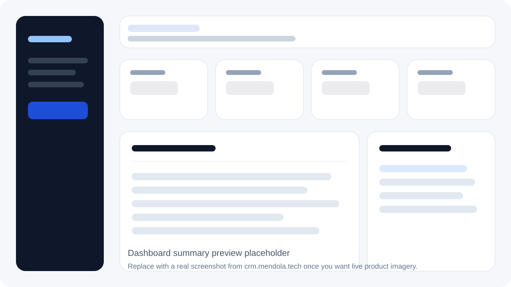
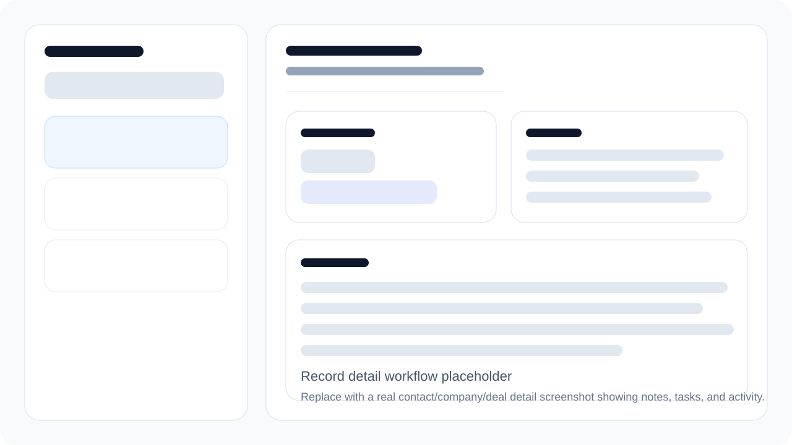
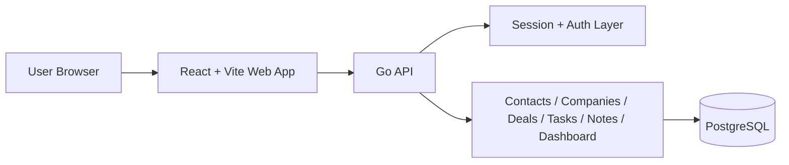

# Open CRM

[](https://github.com/aeml/open_crm/actions/workflows/frontend-pages.yml)
[](https://github.com/aeml/open_crm/actions/workflows/backend-deploy.yml)

> Built by [Robert Mendola](https://mendola.tech)

Open CRM is a production-capable CRM MVP built as a boring, explicit full-stack app: one Go API, one React web app, one Postgres database, and just enough product surface to be useful without turning into enterprise sludge.

## Live links
- App: https://crm.mendola.tech
- API: https://crmserver.mendola.tech
- Repo: https://github.com/aeml/open_crm

## Preview



> Replace the placeholder SVGs in `docs/media/` with real product screenshots or a short workflow GIF when you want the README to show live UI instead of polished stand-ins.

## Why this project exists
- Ship a real CRM workflow surface without hiding behind fake architecture
- Prove that a modular monolith can stay clean, fast to debug, and production-ready
- Cover the day-to-day operator loop: contacts, companies, deals, tasks, notes, activity, and dashboard visibility
- Keep the stack small enough that runtime behavior is obvious when something breaks

## What ships today
- Workspace bootstrap and owner sign-in flow
- Organization users and role-aware settings
- Contacts, companies, and deals with searchable list + detail workflows
- Notes and tasks attached directly to contacts, companies, and deals
- Activity history for write operations
- Dashboard summary with live counts and recent activity
- Business-profile adaptation for different CRM operating modes
- Production deploys for both frontend and backend

## Technical highlights
- Go 1.23 API using `net/http`, `ServeMux`, `pgx/v5`, explicit SQL, and server-side sessions
- React 18 + Vite + React Router frontend with plain CSS and small reusable UI primitives
- PostgreSQL 16 as the source of truth for auth, CRM records, tasks, notes, and dashboard data
- Thin fetch-based API clients instead of a heavy frontend state framework
- Vitest + Testing Library on the frontend, Go `testing` + `httptest` on the backend
- GitHub Actions deployment split cleanly between static frontend hosting and SSH-based backend rollout

## What it demonstrates
- Full-stack product execution instead of toy scaffolding
- Clear runtime behavior over abstraction theater
- Boring deployment primitives that are easy to reason about
- Shipping useful operator workflows without dependency sprawl

## Architecture at a glance



## Stack

| Layer | Technology |
|-------|------------|
| Frontend | React 18, Vite, React Router, plain CSS |
| Backend | Go 1.23, stdlib `net/http`, `pgx/v5` |
| Auth | Argon2id password hashing, signed opaque session cookie, Postgres-backed sessions |
| Database | PostgreSQL 16 via Docker Compose |
| Testing | Vitest, Testing Library, Go `testing`, `httptest` |
| Deploy | GitHub Pages for frontend, GitHub Actions + SSH + Docker Compose for backend |

## Local development

Prerequisites:
- Go 1.23+
- Node.js 18+
- Docker with Compose plugin

Quick start:

```bash
cp .env.example .env
make db-up
make db-migrate
make api-dev
make web-dev
```

Useful commands:

```bash
make db-up       # start Postgres
make db-down     # stop the compose stack
make db-migrate  # run migrations
make db-seed     # seed local data
make api-dev     # run the Go API
make web-dev     # run the Vite frontend
make test        # backend + frontend tests
```

## Repo layout

```text
open_crm/
├── apps/
│   ├── api/     # Go API, migrations, seed/migrate commands
│   └── web/     # React frontend
├── scripts/     # deploy helpers
├── .github/workflows/
│   ├── frontend-pages.yml
│   └── backend-deploy.yml
├── docker-compose.deploy.yml
├── Makefile
└── mvp.md
```

## Deployment

Frontend deploy:
- `.github/workflows/frontend-pages.yml`
- Runs frontend tests, builds `apps/web`, and deploys to GitHub Pages
- Injects `VITE_API_BASE_URL=https://crmserver.mendola.tech`
- Copies `index.html` to `404.html` so client-side routing still works on Pages

Backend deploy:
- `.github/workflows/backend-deploy.yml`
- Syncs the repo to `aeml@ssh.mendola.tech:~/open_crm`
- Writes `.env.production` from the `DEPLOY_ENV` GitHub secret
- Runs `scripts/remote-deploy.sh` on the remote host
- Rebuilds the API, runs migrations, and preserves the existing Postgres volume

Required GitHub secrets:
- `SSH_PRIVATE_KEY`
- `DEPLOY_ENV`

Example `DEPLOY_ENV`:

```env
POSTGRES_DB=open_crm
POSTGRES_USER=open_crm
POSTGRES_PASSWORD=***
API_PORT=18089
SESSION_COOKIE_SECRET=***
ALLOWED_ORIGINS=https://crm.mendola.tech
GO_ENV=production
```

## Product scope

This repo intentionally stays focused on the core CRM loop:
- organizations and users
- contacts and companies
- deals and pipeline tracking
- notes, tasks, and activity history
- dashboard visibility and basic filtering/search

Explicit non-goals for MVP:
- marketing automation
- email sync
- calendar sync
- workflow-engine nonsense
- microservices
- public API/platform ambitions before the core product earns them

## Status

This is an MVP-complete foundation for a clean, operator-focused CRM.
The next work should come from real usage friction, not invented architecture projects.
